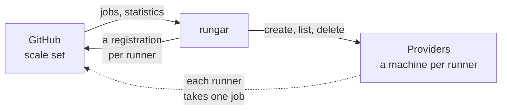

Rungar runs GitHub Actions runners as virtual machines -- or, on a Docker
host, as containers. It is one daemon, `rungar`, that sits between GitHub
and the machines the runners run on: it learns from GitHub how many jobs are
waiting for a runner, and keeps that many runners alive, each a machine of
its own that takes one job and is then destroyed.

## GitHub's side

A workflow names what it runs on, `runs-on: rungar-c2-m4`, and that name is a
[scale set](../scale-sets): a group of runners GitHub queues jobs for. Rungar
finds the scale set on GitHub when it starts, and creates it if it is not
there.

For each scale set Rungar holds a *message session* with GitHub: a long poll,
over which GitHub says when a job is waiting, when one starts on a runner, and
when one completes. Every message carries the scale set's statistics, and the
one Rungar scales on is how many jobs are assigned to it. That number is always
current, so Rungar keeps no queue of its own.

Everything goes from Rungar to GitHub. There are no webhooks, and nothing on
GitHub's side needs to reach Rungar, so it can run behind a firewall that lets
nothing in.

## Inside the daemon

Each scale set gets its own pieces, and scale sets share the providers they
are placed on:

- The **listener** holds the message session, and passes on what GitHub says.
- The **scaler** decides how many runners there should be: one for every
  assigned job, plus the scale set's `min_runners` kept idle and ready, up to
  its `max_runners`. It asks for more when there are too few, and gives back
  idle ones when there are too many.
- The **runner manager** makes and removes runners, knows which are idle and
  which are busy, and regularly -- every 30 seconds, unless configured
  otherwise -- compares what it knows with what is actually on its providers.
  See [Runner lifecycle](../runner-lifecycle).
- The **fleet** is every [provider](../providers): it tries them in the order
  the scale set's placement puts them until one makes the runner, and
  remembers what each refusal said -- full, unable ever to make it, or
  failing -- to skip that provider for a while. See [Placement](../placement).
- A **provider** is one backend -- a Dicer host, a cluster, a cloud account
  -- which makes a machine and decides for itself where on the backend it
  goes. It is the only part that knows how a machine is made there, and
  everything above it works the same whichever backend it is. See
  [Providers](../providers).

## From a job to a machine

When the number of assigned jobs goes up, the scaler asks for a runner, and
the runner manager:

1. asks GitHub to register a runner by a name of its own, and gets back a
   just-in-time configuration, good for that one runner;
2. asks the scale set's providers, in the order its
   [placement](../placement) puts them, to create a machine carrying the
   configuration, until one does: a provider that is full refuses, and the
   next is asked.

The machine boots the runner image, the runner inside it connects to GitHub
with its configuration, and GitHub gives it a job. When the job completes,
GitHub says so over the message session, and Rungar destroys the machine.
Nothing about it is kept.

## One job per VM

A runner is never given a second job, and a VM is never reused. That is the
point of running runners this way: a job starts on a machine nobody has used,
with a kernel of its own, and whatever it leaves behind -- files, processes,
credentials, a compromised toolchain -- goes with the VM. Two jobs share
nothing but the host underneath them.

A runner on a Docker host is a container instead, and shares the host's
kernel: each job still starts clean, but the isolation is a container's.
See [Docker](../../reference/providers/docker).

It is also why Rungar never takes a runner away mid-job. A runner is removed
when its job ends, or when it is idle and no longer needed -- and then only
once GitHub has confirmed it is not about to be given one.

## What Rungar keeps

Nothing. Every machine Rungar creates is labelled with the scale set it
belongs to, and those labels are the only record there is: a daemon that
starts or restarts finds its runners by listing its providers, and carries
on. A job running at the time is not disturbed. See [State and
adoption](../state-and-adoption).
