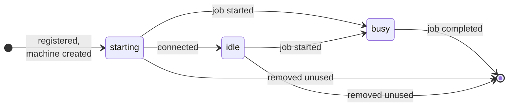

A runner lives for one job. Rungar registers it with GitHub, starts a machine for
it, lets GitHub give it a job, and destroys it when the job is done. Nothing
about it is reused: the next job gets a new runner, a new machine and a new
registration.

## Registration

A runner's name is its scale set's with a random suffix, such as
`rungar-c2-m4-1ff1015a`. It is the name of its machine, of the host inside it,
and of the runner on GitHub -- one name, which is how a message from GitHub
about a runner finds the machine to destroy.

For each runner Rungar asks GitHub for a **just-in-time configuration**: a
registration issued for that name alone, which the runner uses once to connect
and which is good for nothing after. GitHub lists the runner from the moment
the configuration is issued, as offline until it connects.

The provider hands the configuration to the machine, in whatever way its backend
allows, and the runner inside uses it to connect; each provider's reference
says how. Rungar never logs it, but the backend holds it as part of the machine,
so whoever can use the backend's API may be able to read it until the runner
has used it.

## Starting, idle and busy

- **Starting** is a runner whose machine Rungar has created, and which has
  not yet connected to GitHub.
- **Idle** is a runner connected to GitHub and waiting for a job. Rungar asks
  GitHub which runners are connected on every reconciliation, so a runner is
  idle within half a minute or so of connecting.
- **Busy** is a runner GitHub has given a job, which it says over the message
  session -- or, if that message is late or went to a Rungar since restarted,
  in its answer on the next reconciliation. A runner can go straight from
  starting to busy.

A runner found on the fleet rather than made by this daemon -- after a
restart, say -- is remembered as **adopted**, and takes whatever state GitHub
says it is in. See [State and adoption](../state-and-adoption).

## The end of a runner

The usual end is the job completing. GitHub says so, and Rungar deletes the
machine; the runner, having taken its one job, would have exited anyway, and
with it the machine, which is never restarted -- a provider has its backend
remove it when it stops, where the backend can. The registration goes with
the job: GitHub removes an ephemeral runner once it has run.

A runner can also end without a job: when the scale set has more than it
needs, when reconciliation finds it should go, or when it is removed by
hand. Rungar
then removes it the safe way round:

1. It asks GitHub to remove the runner's registration. Once that is gone, no
   job can be given to the runner.
2. Only then does it delete the machine.

GitHub refuses to remove a runner it has just given a job -- one whose job
Rungar has not yet heard of. Rungar then takes the runner for busy and leaves
it. If GitHub cannot be asked at all, the runner is left too, and tried again
later: without GitHub's word, it might be running a job. A runner is taken
away mid-job only when reconciliation finds it stuck, or older than the scale
set's `max_age`; see below.

A runner whose machine fails to be created has its registration removed straight
away, so that it is not left on GitHub as an offline runner.

## Reconciliation

GitHub's messages are not the only thing that can end a runner: a machine can be
killed, a host can be rebooted, a registration can be dropped. So every
`reconcile_interval` -- 30 seconds unless set -- Rungar compares what it knows
with what is on its providers:

- A runner whose **machine is gone** is forgotten, and its registration
  removed if it never ran a job.
- A runner whose **machine has stopped** is removed: a runner is never started
  twice, so a stopped one has done its job or never will.
- A **machine Rungar does not know** but that carries its scale set's labels is
  adopted.
- A runner **not connected to GitHub** is given the scale set's
  `start_timeout` to connect: a new one from when it was made, an idle one
  from when it was first found disconnected. One still not connected after
  that is removed and replaced, as is one whose registration GitHub no longer
  has.
- A runner **running a job while disconnected from GitHub** for
  `start_timeout` is stuck -- its machine wedged, or its job's end never heard
  of -- and is removed.
- A runner **made from an older runner block** is replaced once it is not
  running a job. Every machine carries a label naming the revision of the
  block it was made from, so a changed `runner` block reaches the runners
  already made, after a restart as much as before.
- A runner **older than `max_idle_age`** is replaced once it is not running a
  job, and one **older than `max_age`** is removed even if it is, which fails
  its job. Both are unset unless set.
- A runner on a **provider that cannot be reached** is left alone, for up to
  five minutes, and then forgotten and replaced elsewhere; see
  [State and adoption](../state-and-adoption#providers-that-cannot-be-reached).

Runners that could still take a job -- those replaced for their block or their
age -- are replaced one per pass, so that a scale set's reserve is never
emptied at once. When a scale set has more runners than it needs, it gives
back those made from an older block first, then the oldest.

## Stopping Rungar

When Rungar stops, it leaves every runner where it is, and the next Rungar to
start adopts them. To be rid of a scale set's runners, remove the scale set;
see [Draining, pausing and
removing](../../guides/managing-the-fleet#removing-a-scale-set).

## Runners that never connect

A machine can boot and still never be a runner: an image without the runner
in it, a command that starts something else, a network that cannot reach
GitHub. Such a machine holds its provider's room, and counts towards its
scale set -- so without anything done about it, it would stand in for a
runner that could take a job, and the job would wait.

This is why Rungar asks GitHub whether each runner is connected, rather than
only whether it is registered: GitHub lists a runner from the moment its
registration is issued, connected or not. A runner that has not connected
within `start_timeout` is removed and replaced, and the warning Rungar logs
says so. A scale set whose runners are all removed this way has something
wrong with its image or its network; see
[Troubleshooting](../../guides/troubleshooting).
